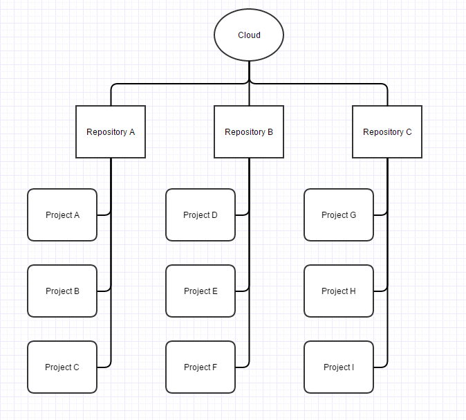

# Content management system

System contains next content types:
* Cloud
* Repository
* Project

User can has multiple clouds. Each cloud can have multiple repositories and each repository can have multiple projects.

Each content type contains access roles with different permissions.
* Admin - can view, edit, manage user roles
* Editor - can view and edit content
* Viewer - can view content 
* Verifier - users with this role see all pull requests. Verifiers must analyze changes and accept or decline them

Content diagram:

